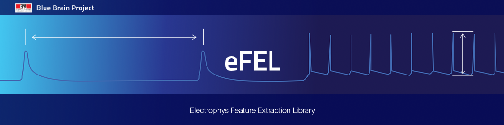

<table>
<tr>
  <td>Latest Release</td>
  <td>
    <a href="https://pypi.org/project/efel/">
    
    </a>
  </td>
</tr>
<tr>
  <td>Documentation</td>
  <td>
    <a href="https://efel.readthedocs.io/">
    
    </a>
  </td>
</tr>
<tr>
  <td>License</td>
  <td>
    <a href="https://github.com/BlueBrain/efel/blob/master/LICENSE.txt">
    
    </a>
</td>
</tr>
<tr>
  <td>Build Status</td>
  <td>
    <a href="https://github.com/BlueBrain/eFEL/actions">
    
    </a>
  </td>
</tr>
<tr>
  <td>Coverage</td>
  <td>
    <a href="https://codecov.io/gh/BlueBrain/efel">
    
    </a>
  </td>
</tr>
<tr>
    <td>Gitter</td>
    <td>
        <a href="https://gitter.im/bluebrain/efel">
        
    </td>
</tr>
</table>

Introduction
============

The Electrophys Feature Extraction Library (eFEL) allows neuroscientists
to automatically extract features from time series data recorded from neurons
(both in vitro and in silico).
Examples are the action potential width and amplitude in voltage traces recorded
during whole-cell patch clamp experiments.
The user of the library provides a set of traces and selects the features to
be calculated. The library will then extract the requested features and return
the values to the user.

The core of the library is written in C++, and a Python wrapper is included.
At the moment we provide a way to automatically compile and install the library
as a Python module. Instructions on how to compile the eFEL as a standalone C++ 
library can be found [here](http://efel.readthedocs.io/en/latest/installation.html#installing-the-c-standalone-library).

News
====

* 2016/01/17: We dropped support for Python 2.6. We're following the numpy and coverage module who also dropped support recently.
For the moment eFEL still works with Python 2.6, you will just have to install the right (older) versions of the dependencies.
The eFEL code isn't automatically tested on 2.6 anymore.

Requirements
============

* [Python 2.7+](https://www.python.org/download/releases/2.7/) or [Python 3.4+](https://www.python.org/download/releases/3.4.3/)
* [Pip](https://pip.pypa.io) (installed by default in newer versions of Python)
* C++ compiler that can be used by pip
* [Numpy](http://www.numpy.org) (will be installed automatically by pip)
* The instruction below are written assuming you have access to a command shell
on Linux / UNIX / MacOSX / Cygwin

Installation
============

The easiest way to install eFEL is to use [pip](https://pip.pypa.io)

```bash
pip install efel
```

In case you don't have administrator access this command might fail with a
permission error. In that case you could install eFEL in your home directory

```bash
pip install efel --user
```

Or you could use a [python virtual environment](https://virtualenv.pypa.io)

```bash
virtualenv pythonenv
. ./pythonenv/bin/activate
# If you use csh or tcsh, you should use:
# source ./pythonenv/bin/activate.csh
pip install efel
```

If you want to install straight from the github repository you can use

```bash
pip install git+git://github.com/BlueBrain/eFEL
```

Quick Start
===========

First you need to import the module

```python
import efel
```

To get a list with all the available feature names

```python
efel.getFeatureNames()
```

The python function to extract features is getFeatureValues(...).
Below is a short example on how to use this function. The code and example
trace are available
[here](https://github.com/BlueBrain/eFEL/blob/master/examples/basic/basic_example1.py)

```python
"""Basic example 1 for eFEL"""

import efel
import numpy

def main():
    """Main"""

    # Use numpy to read the trace data from the txt file
    data = numpy.loadtxt('example_trace1.txt')

    # Time is the first column
    time = data[:, 0]
    # Voltage is the second column
    voltage = data[:, 1]

    # Now we will construct the datastructure that will be passed to eFEL

    # A 'trace' is a dictionary
    trace1 = {}

    # Set the 'T' (=time) key of the trace
    trace1['T'] = time

    # Set the 'V' (=voltage) key of the trace
    trace1['V'] = voltage

    # Set the 'stim_start' (time at which a stimulus starts, in ms)
    # key of the trace
    # Warning: this need to be a list (with one element)
    trace1['stim_start'] = [700]

    # Set the 'stim_end' (time at which a stimulus end) key of the trace
    # Warning: this need to be a list (with one element)
    trace1['stim_end'] = [2700]

    # Multiple traces can be passed to the eFEL at the same time, so the
    # argument should be a list
    traces = [trace1]

    # Now we pass 'traces' to the efel and ask it to calculate the feature
    # values
    traces_results = efel.getFeatureValues(traces,
                                           ['AP_amplitude', 'voltage_base'])

    # The return value is a list of trace_results, every trace_results
    # corresponds to one trace in the 'traces' list above (in same order)
    for trace_results in traces_results:
        # trace_result is a dictionary, with as keys the requested features
        for feature_name, feature_values in trace_results.items():
            print "Feature %s has the following values: %s" % \
                (feature_name, ', '.join([str(x) for x in feature_values]))


if __name__ == '__main__':
    main()
```

The output of this example is
```
Feature AP_amplitude has the following values: 72.5782441262, 46.3672552618, 41.1546679158, 39.7631750953, 36.1614653031, 37.8489295737
Feature voltage_base has the following values: -75.446665721
```
This means that the eFEL found 5 action potentials in the voltage trace. The
amplitudes of these APs are the result of the 'AP_amplitude' feature.
The voltage before the start of the stimulus is measured by 'voltage_base'.
Results are in mV.

Full documentation
==================
The full documentation can be found [here](http://efel.readthedocs.io)

Funding
=======
This work has been partially funded by the European Union Seventh Framework Program (FP7/2007­2013) under grant agreement no. 604102 (HBP), the European Union’s Horizon 2020 Framework Programme for Research and Innovation under the Specific Grant Agreement No. 720270, 785907 (Human Brain Project SGA1/SGA2) and by the EBRAINS research infrastructure, funded from the European Union’s Horizon 2020 Framework Programme for Research and Innovation under the Specific Grant Agreement No. 945539 (Human Brain Project SGA3).
