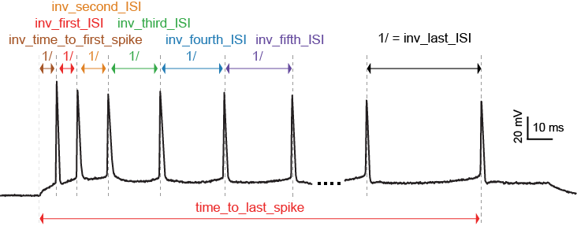
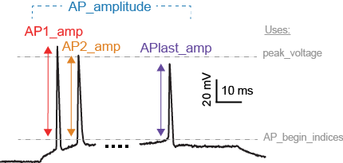
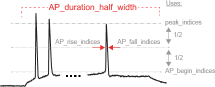

.. role:: red

=====================
eFeature descriptions
=====================

A pdf document describing the eFeatures is available
`here <http://bluebrain.github.io/eFEL/efeature-documentation.pdf>`_.

Not every eFeature has a description in this document yet,
the complete set will be available shortly.

Implemented eFeatures (to be continued)
=======================================

Spike event features
--------------------

**LibV5 : inv_time_to_first_spike**

1.0 over time to first spike; returns 0 when no spike

- **Required features**: time_to_first_spike
- **Units**: Hz
- **Pseudocode**: ::

    if len(time_to_first_spike) > 0:
        inv_time_to_first_spike = 1.0 / time_to_first_spike[0]
    else:
        inv_time_to_first_spike = 0

**LibV5 : inv_first_ISI, inv_second_ISI, inv_third_ISI, inv_fourth_ISI, inv_fith_ISI, inv_last_ISI**

1.0 over first/second/third/fourth/fith/last ISI; returns 0 when no ISI

- **Required features**: peak_time (ms)
- **Units**: Hz
- **Pseudocode**: ::

    all_isi_values_vec = numpy.diff(peak_time)
    if len(all_isi_values_vec) > 1:
        inv_first_ISI = 1000.0 / all_isi_values_vec[0]
    else:
        inv_first_ISI = 0

    if len(all_isi_values_vec) > 0:
        inv_first_ISI = 1000.0 / all_isi_values_vec[0]
    else:
        inv_first_ISI = 0

    if len(all_isi_values_vec) > 1:
        inv_second_ISI = 1000.0 / all_isi_values_vec[1]
    else:
        inv_second_ISI = 0

    if len(all_isi_values_vec) > 2:
        inv_third_ISI = 1000.0 / all_isi_values_vec[2]
    else:
        inv_third_ISI = 0

    if len(all_isi_values_vec) > 3:
        inv_fourth_ISI = 1000.0 / all_isi_values_vec[3]
    else:
        inv_fourth_ISI = 0

    if len(all_isi_values_vec) > 4:
        inv_fifth_ISI = 1000.0 / all_isi_values_vec[4]
    else:
        inv_fifth_ISI = 0

    if len(all_isi_values_vec) > 0:
        inv_last_ISI = 1000.0 / all_isi_values_vec[-1]
    else:
        inv_last_ISI = 0

**LibV5 : time_to_last_spike**

time from stimulus start to last spike

- **Required features**: peak_time (ms), stimstart (ms)
- **Units**: ms
- **Pseudocode**: ::

    if len(peak_time) > 0:
        time_to_last_spike = peak_time[-1] - stimstart
    else:
        time_to_last_spike = 0

**LibV1 : Spikecount**                                                           

number of spikes in the trace                                                    

- **Required features**: LibV1:peak_indices                                     
- **Units**: constant                                                            
- **Pseudocode**: ::

    Spikecount = len(peak_indices)

**LibV5 : number_initial_spikes**

number of spikes at the beginning of the stimulus

- **Required features**: LibV1:peak_time
- **Required parameters**: initial_perc
- **Units**: constant
- **Pseudocode**: ::

    initial_length = (stimend - stimstart) * initial_perc
    number_initial_spikes = len(numpy.where( \
        (peak_time >= stimstart) & \
        (peak_time <= stimstart + initial_length)))

Spike shape features
--------------------

**LibV1 : AP_Amplitude, AP1_amp, AP2_amp, APlast_amp**

The relative height of the action potential from spike onset

- **Required features**: LibV5:AP_begin_indices, LibV1:peak_voltage (mV)
- **Units**: mV
- **Pseudocode**: ::

    AP_Amplitude = voltage[AP_begin_indices] - peak_voltage
    AP1_amp = AP_Amplitude[0]
    AP2_amp = AP_Amplitude[1]
    APlast_amp = AP_Amplitude[-1]

.. image:: figures/AHP.png

**LibV1 : AHP_depth**

Relative voltage values at the first after-hyperpolarization

- **Required features**: LibV1:voltage_base (mV), LibV5:min_AHP_values (mV)
- **Units**: mV
- **Pseudocode**: ::

    min_AHP_values = first_min_element(voltage, peak_indices)
    AHP_depth = min_AHP_values[:] - voltage_base

**LibV5 : AHP_time_from_peak**

Time between AP peaks and first AHP depths

- **Required features**: LibV1:peak_indices, LibV5:min_AHP_values (mV)
- **Units**: mV
- **Pseudocode**: ::

    min_AHP_indices = first_min_element(voltage, peak_indices)
    AHP_time_from_peak = t[min_AHP_indices[:]] - t[peak_indices[i]]

**LibV2 : AP_duration_half_width**

Width of spike at half spike amplitude

- **Required features**: LibV2: AP_rise_indices, LibV2: AP_fall_indices
- **Units**: ms
- **Pseudocode**: ::

    AP_rise_indices = index_before_peak((v(peak_indices) - v(AP_begin_indices)) / 2)
    AP_fall_indices = index_after_peak((v(peak_indices) - v(AP_begin_indices)) / 2)
    AP_duration_half_width = t(AP_fall_indices) - t(AP_rise_indices)

Voltage features
----------------

.. image:: figures/voltage_features.png

**LibV5 : steady_state_voltage_stimend**

The average voltage during the last 90% of the stimulus duration.

- **Required features**: t, V, stim_start, stim_end
- **Units**: mV
- **Pseudocode**: ::

    stim_duration = stim_end - stim_start
    begin_time = stim_end - 0.1 * stim_duration
    end_time = stim_end
    steady_state_voltage_stimend = numpy.mean(voltage[numpy.where((t < end_time) & (t >= begin_time))])
    

**LibV1 : steady_state_voltage**

The average voltage after the stimulus

- **Required features**: t, V, stim_end
- **Units**: mV
- **Pseudocode**: ::

    steady_state_voltage = numpy.mean(voltage[numpy.where((t <= max(t)) & (t > stim_end))])

Requested eFeatures
===================

**LibV1 : AHP_depth_last**

Relative voltage values at the last after-hyperpolarization

- **Required features**: LibV1:voltage_base (mV), LibV5:last_AHP_values (mV)
- **Units**: mV
- **Pseudocode**: ::

    last_AHP_values = last_min_element(voltage, peak_indices)
    AHP_depth = last_AHP_values[:] - voltage_base

**LibV5 : AHP_time_from_peak_last**

Time between AP peaks and last AHP depths

- **Required features**: LibV1:peak_indices, LibV5:min_AHP_values (mV)
- **Units**: mV
- **Pseudocode**: ::

    last_AHP_indices = last_min_element(voltage, peak_indices)
    AHP_time_from_peak_last = t[last_AHP_indices[:]] - t[peak_indices[i]]
    

**LibV5 : voltage_base**

The average voltage during the last 90% before the stimulus onset.

- **Required features**: t, V, stim_start, stim_end
- **Units**: mV
- **Pseudocode**: ::

    begin_time = 0.9 * stim_start[0]
    end_time = stim_start[0]
    voltage_base = [numpy.mean(voltage[numpy.where((t <= end_time) & (t >= begin_time))])]
    

**LibV5 : steady_state_voltage_stimend_from_voltage_base**

The average voltage during the last 90% of the stimulus duration realtive to voltage_base

- **Required features**: LibV5: steady_state_voltage_stimend (mV), LibV5: voltage_base (mV)
- **Units**: mV
- **Pseudocode**: ::

    steady_state_voltage_stimend_from_voltage_base = steady_state_voltage_stimend - voltage_base

**LibV5 : min_duringstim**
The minimum voltage during stimulus

- **Required features**:
- **Units**: mV
- **Pseudocode**: ::

    min_duringstim = [numpy.min(voltage[numpy.where((t <= stim_end[0]) & (t >= stim_start[0]))])]

**LibV5 : min_duringstim_from_voltage_base**
The minimum voltage during stimulus

- **Required features**: LibV5: min_duringstim (mV), LibV5: voltage_base (mV)
- **Units**: mV
- **Pseudocode**: ::

    min_duringstim_from_voltage_base = min_duringstim - voltage_base

**LibV5 : max_duringstim**
The minimum voltage during stimulus

- **Required features**:
- **Units**: mV
- **Pseudocode**: ::

    min_duringstim = [numpy.max(voltage[numpy.where((t <= stim_end[0]) & (t >= stim_start[0]))])]

**LibV5 : max_duringstim_from_voltage_base**
The minimum voltage during stimulus

- **Required features**: LibV5: max_duringstim (mV), LibV5: voltage_base (mV)
- **Units**: mV
- **Pseudocode**: ::

    max_duringstim_from_voltage_base = max_duringstim - voltage_base
    
**LibV5 : diff_max_duringstim**
Difference between maximum and steady state during stimulation

- **Required features**: LibV5: max_duringstim (mV), LibV5: steady_state_voltage_stimend (mV)
- **Units**: mV
- **Pseudocode**: ::

    diff_max_duringstim: max_duringstim - steady_state_voltage_stimend
    
**LibV5 : diff_min_duringstim**
Difference between minimum and steady state during stimulation

- **Required features**: LibV5: min_duringstim (mV), LibV5: steady_state_voltage_stimend (mV)
- **Units**: mV
- **Pseudocode**: ::

    diff_min_duringstim: min_duringstim - steady_state_voltage_stimend

