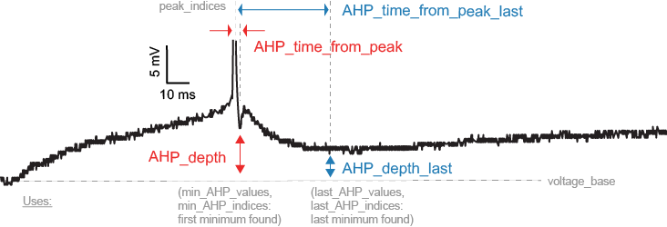
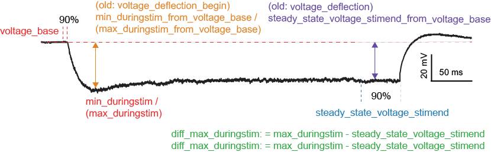
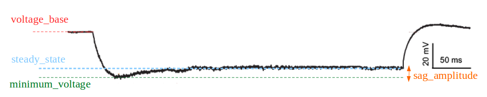

.. role:: red

=====================
eFeature descriptions
=====================

A pdf document describing the eFeatures is available
`here <http://bluebrain.github.io/eFEL/efeature-documentation.pdf>`_.

Not every eFeature has a description in this document yet,
the complete set will be available shortly.

Implemented eFeatures (to be continued)
=======================================

Spike event features
--------------------

.. image:: _static/figures/inv_ISI.png

LibV1 : time_to_first_spike
~~~~~~~~~~~~~~~~~~~~~~~~~~~

Time from the start of the stimulus to the maximum of the first peak

- **Required features**: peak_time
- **Units**: ms
- **Pseudocode**: ::

    time_to_first_spike = peaktime[0] - stimstart

LibV5 : time_to_second_spike
~~~~~~~~~~~~~~~~~~~~~~~~~~~~

Time from the start of the stimulus to the maximum of the second peak

- **Required features**: peak_time
- **Units**: ms
- **Pseudocode**: ::

    time_to_second_spike = peaktime[1] - stimstart

LibV5 : inv_time_to_first_spike
~~~~~~~~~~~~~~~~~~~~~~~~~~~~~~~

1.0 over time to first spike; returns 0 when no spike

- **Required features**: time_to_first_spike
- **Units**: Hz
- **Pseudocode**: ::

    if len(time_to_first_spike) > 0:
        inv_time_to_first_spike = 1.0 / time_to_first_spike[0]
    else:
        inv_time_to_first_spike = 0

LibV5 : inv_first_ISI, inv_second_ISI, inv_third_ISI, inv_fourth_ISI, inv_fifth_ISI, inv_last_ISI
~~~~~~~~~~~~~~~~~~~~~~~~~~~~~~~~~~~~~~~~~~~~~~~~~~~~~~~~~~~~~~~~~~~~~~~~~~~~~~~~~~~~~~~~~~~~~~~~~

1.0 over first/second/third/fourth/fith/last ISI; returns 0 when no ISI

- **Required features**: peak_time (ms)
- **Units**: Hz
- **Pseudocode**: ::

    all_isi_values_vec = numpy.diff(peak_time)
    if len(all_isi_values_vec) > 1:
        inv_first_ISI = 1000.0 / all_isi_values_vec[0]
    else:
        inv_first_ISI = 0

    if len(all_isi_values_vec) > 0:
        inv_first_ISI = 1000.0 / all_isi_values_vec[0]
    else:
        inv_first_ISI = 0

    if len(all_isi_values_vec) > 1:
        inv_second_ISI = 1000.0 / all_isi_values_vec[1]
    else:
        inv_second_ISI = 0

    if len(all_isi_values_vec) > 2:
        inv_third_ISI = 1000.0 / all_isi_values_vec[2]
    else:
        inv_third_ISI = 0

    if len(all_isi_values_vec) > 3:
        inv_fourth_ISI = 1000.0 / all_isi_values_vec[3]
    else:
        inv_fourth_ISI = 0

    if len(all_isi_values_vec) > 4:
        inv_fifth_ISI = 1000.0 / all_isi_values_vec[4]
    else:
        inv_fifth_ISI = 0

    if len(all_isi_values_vec) > 0:
        inv_last_ISI = 1000.0 / all_isi_values_vec[-1]
    else:
        inv_last_ISI = 0

LibV5 : time_to_last_spike
~~~~~~~~~~~~~~~~~~~~~~~~~~

time from stimulus start to last spike

- **Required features**: peak_time (ms), stimstart (ms)
- **Units**: ms
- **Pseudocode**: ::

    if len(peak_time) > 0:
        time_to_last_spike = peak_time[-1] - stimstart
    else:
        time_to_last_spike = 0

LibV1 : Spikecount
~~~~~~~~~~~~~~~~~~

number of spikes in the trace, including outside of stimulus interval

- **Required features**: LibV1:peak_indices
- **Units**: constant
- **Pseudocode**: ::

    Spikecount = len(peak_indices)

LibV5 : Spikecount_stimint
~~~~~~~~~~~~~~~~~~~~~~~~~~

number of spikes inside the stimulus interval

- **Required features**: LibV1:peak_time
- **Units**: constant
- **Pseudocode**: ::

    peaktimes_stimint = numpy.where((peak_time >= stim_start) & (peak_time <= stim_end)) 
    Spikecount_stimint = len(peaktimes_stimint)

LibV5 : number_initial_spikes
~~~~~~~~~~~~~~~~~~~~~~~~~~~~~

number of spikes at the beginning of the stimulus

- **Required features**: LibV1:peak_time
- **Required parameters**: initial_perc (default=0.1)
- **Units**: constant
- **Pseudocode**: ::

    initial_length = (stimend - stimstart) * initial_perc
    number_initial_spikes = len(numpy.where( \
        (peak_time >= stimstart) & \
        (peak_time <= stimstart + initial_length)))

LibV1 : mean_frequency
~~~~~~~~~~~~~~~~~~~~~~

The mean frequency of the firing rate

- **Required features**: stim_start, stim_end, LibV1:peak_time
- **Units**: Hz
- **Pseudocode**: ::

    condition = np.all((stim_start < peak_time, peak_time < stim_end), axis=0)
    spikecount = len(peak_time[condition])
    last_spike_time = peak_time[peak_time < stim_end][-1]
    mean_frequency = 1000 * spikecount / (last_spike_time - stim_start)

LibV5 : ISI_semilog_slope
~~~~~~~~~~~~~~~~~~~~~~~~~

The slope of a linear fit to a semilog plot of the ISI values

- **Required features**: t, V, stim_start, stim_end, ISI_values
- **Units**: ms
- **Pseudocode**: ::

    x = range(1, len(ISI_values)+1)
    log_ISI_values = numpy.log(ISI_values)
    slope, _ = numpy.polyfit(x, log_ISI_values, 1)

    ISI_semilog_slope = slope

LibV5 : ISI_log_slope
~~~~~~~~~~~~~~~~~~~~~

The slope of a linear fit to a loglog plot of the ISI values

- **Required features**: t, V, stim_start, stim_end, ISI_values
- **Units**: ms
- **Pseudocode**: ::

    log_x = numpy.log(range(1, len(ISI_values)+1))
    log_ISI_values = numpy.log(ISI_values)
    slope, _ = numpy.polyfit(log_x, log_ISI_values, 1)

    ISI_log_slope = slope

LibV1 : ISI_CV
~~~~~~~~~~~~~~

The coefficient of variation of the ISIs

- **Required features**: ISI_values
- **Units**: constant
- **Pseudocode**: ::

    ISI_mean = numpy.mean(ISI_values)
    ISI_variance = numpy.sum(numpy.square(ISI_values-ISI_mean)) / (len(ISI_values)-1)
    ISI_std = math.sqrt(ISI_variance)
    ISI_CV = ISI_std / ISI_mean

LibV5 : check_AISInitiation
~~~~~~~~~~~~~~~~~~~~~~~~~~~

Check initiation of AP in AIS

- **Required features**: t, V, stim_start, stim_end, AP_begin_time, AP_begin_time;location_AIS
- **Units**: ms
- **Pseudocode**: ::

    if len(AP_begin_time) != len(AP_begin_time;location_AIS):
        return None
    for soma_time, ais_time in zip(AP_begin_time, AP_begin_time;location_AIS):
        if soma_time < ais_time:
            return None
    return [1]

LibV1 : burst_number
~~~~~~~~~~~~~~~~~~~~

The number of bursts

- **Required features**: burst_mean_freq
- **Units**: constant
- **Pseudocode**: ::

    burst_number = len(burst_mean_freq)

Spike shape features
--------------------

.. image:: _static/figures/AP_Amplitude.png

LibV1 : AP_Amplitude, AP1_amp, AP2_amp, APlast_amp
~~~~~~~~~~~~~~~~~~~~~~~~~~~~~~~~~~~~~~~~~~~~~~~~~~

The relative height of the action potential from spike onset

- **Required features**: LibV5:AP_begin_indices, LibV1:peak_voltage (mV)
- **Units**: mV
- **Pseudocode**: ::

    AP_Amplitude = voltage[AP_begin_indices] - peak_voltage
    AP1_amp = AP_Amplitude[0]
    AP2_amp = AP_Amplitude[1]
    APlast_amp = AP_Amplitude[-1]

LibV1 : AHP_depth_abs
~~~~~~~~~~~~~~~~~~~~~

Absolute voltage values at the first after-hyperpolarization

- **Required features**: LibV5:min_AHP_values (mV)
- **Units**: mV

LibV1 : AHP_depth_abs_slow
~~~~~~~~~~~~~~~~~~~~~~~~~~

Absolute voltage values at the first after-hyperpolarization starting 
a given number of ms (default: 5) after the peak

- **Required features**: LibV1:peak_indices
- **Units**: mV

LibV1 : AHP_slow_time
~~~~~~~~~~~~~~~~~~~~~

Time difference between slow AHP (see AHP_depth_abs_slow) and peak, divided by
interspike interval 

- **Required features**: LibV1:AHP_depth_abs_slow
- **Units**: constant
  
LibV1 : AHP_depth
~~~~~~~~~~~~~~~~~

Relative voltage values at the first after-hyperpolarization

- **Required features**: LibV1:voltage_base (mV), LibV5:min_AHP_values (mV)
- **Units**: mV
- **Pseudocode**: ::

    min_AHP_values = first_min_element(voltage, peak_indices)
    AHP_depth = min_AHP_values[:] - voltage_base

LibV5 : AHP_time_from_peak
~~~~~~~~~~~~~~~~~~~~~~~~~~

Time between AP peaks and first AHP depths

- **Required features**: LibV1:peak_indices, LibV5:min_AHP_values (mV)
- **Units**: mV
- **Pseudocode**: ::

    min_AHP_indices = first_min_element(voltage, peak_indices)
    AHP_time_from_peak = t[min_AHP_indices[:]] - t[peak_indices[i]]

.. image:: _static/figures/AP_duration_half_width.png

LibV2 : AP_duration_half_width
~~~~~~~~~~~~~~~~~~~~~~~~~~~~~~

Width of spike at half spike amplitude

- **Required features**: LibV2: AP_rise_indices, LibV2: AP_fall_indices
- **Units**: ms
- **Pseudocode**: ::

    AP_rise_indices = index_before_peak((v(peak_indices) - v(AP_begin_indices)) / 2)
    AP_fall_indices = index_after_peak((v(peak_indices) - v(AP_begin_indices)) / 2)
    AP_duration_half_width = t(AP_fall_indices) - t(AP_rise_indices)

LibV1 : AP_width
~~~~~~~~~~~~~~~~

Width of spike at threshold

- **Required features**: LibV1: peak_indices, LibV5: min_AHP_indices, threshold
- **Units**: ms
- **Pseudocode**: ::

    min_AHP_indices.append(stim_start_index)
    for i in range(len(min_AHP_indices)-1):
        onset_time[i] = t[numpy.where(v[min_AHP_indices[i]:min_AHP_indices[i+1]] > threshold)[0]]
        offset_time[i] = t[numpy.where(v[min_AHP_indices[i]:min_AHP_indices[i+1]] < threshold && t > onset_time)[0]]
        AP_width[i] = t(offset_time[i]) - t(onset_time[i])

LibV5 : AP_peak_upstroke
~~~~~~~~~~~~~~~~~~~~~~~~

Maximum of rise rate of spike

- **Required features**: LibV5: AP_begin_indices, LibV5: peak_indices
- **Units**: V/s
- **Pseudocode**: ::

    ap_peak_upstroke = []
    for apbi, pi in zip(ap_begin_indices, peak_indices):
        ap_peak_upstroke.append(numpy.max(dvdt[apbi:pi]))

LibV5 : AP_peak_downstroke
~~~~~~~~~~~~~~~~~~~~~~~~~~

Minimum of fall rate from spike

- **Required features**: LibV5: min_AHP_indices, LibV5: peak_indices
- **Units**: V/s
- **Pseudocode**: ::

    ap_peak_downstroke = []
    for ahpi, pi in zip(min_ahp_indices, peak_indices):
        ap_peak_downstroke.append(numpy.min(dvdt[pi:ahpi]))

LibV2 : AP_rise_time
~~~~~~~~~~~~~~~~~~~~

Time between the AP threshold and the peak, given a window
(default: from 0% to 100% of the AP amplitude)

- **Required features**: LibV5: AP_begin_indices, LibV5: peak_indices, LibV1: AP_amplitude
- **Units**: ms
- **Pseudocode**: ::

    rise_times = []
    begin_voltages = AP_amps * rise_start_perc + voltage[AP_begin_indices]
    end_voltages = AP_amps * rise_end_perc + voltage[AP_begin_indices]

    for AP_begin_indice, peak_indice, begin_v, end_v in zip(
        AP_begin_indices, peak_indices, begin_voltages, end_voltages
    ):
        voltage_window = voltage[AP_begin_indice:peak_indice]

        new_begin_indice = AP_begin_indice + numpy.min(
            numpy.where(voltage_window >= begin_v)[0]
        )
        new_end_indice = AP_begin_indice + numpy.max(
            numpy.where(voltage_window <= end_v)[0]
        )

        rise_times.append(time[new_end_indice] - time[new_begin_indice])

Voltage features
----------------

LibV5 : steady_state_voltage_stimend
~~~~~~~~~~~~~~~~~~~~~~~~~~~~~~~~~~~~

The average voltage during the last 10% of the stimulus duration.

- **Required features**: t, V, stim_start, stim_end
- **Units**: mV
- **Pseudocode**: ::

    stim_duration = stim_end - stim_start
    begin_time = stim_end - 0.1 * stim_duration
    end_time = stim_end
    steady_state_voltage_stimend = numpy.mean(voltage[numpy.where((t < end_time) & (t >= begin_time))])

LibV1 : steady_state_voltage
~~~~~~~~~~~~~~~~~~~~~~~~~~~~

The average voltage after the stimulus

- **Required features**: t, V, stim_end
- **Units**: mV
- **Pseudocode**: ::

    steady_state_voltage = numpy.mean(voltage[numpy.where((t <= max(t)) & (t > stim_end))])

LibV5 : voltage_base
~~~~~~~~~~~~~~~~~~~~

The average voltage during the last 10% of time before the stimulus.

- **Required features**: t, V, stim_start, stim_end
- **Parameters**: voltage_base_start_perc (default = 0.9)
                  voltage_base_end_perc (default = 1.0)
- **Units**: mV
- **Pseudocode**: ::

    voltage_base = numpy.mean(voltage[numpy.where(
        (t >= voltage_base_start_perc * stim_start) &
        (t <= voltage_base_end_perc * stim_start))])

LibV5 : decay_time_constant_after_stim
~~~~~~~~~~~~~~~~~~~~~~~~~~~~~~~~~~~~~~

The decay time constant of the voltage right after the stimulus

- **Required features**: t, V, stim_start, stim_end
- **Parameters**: decay_start_after_stim (default = 1.0 ms)
                  decay_end_after_stim (default = 10.0 ms)
- **Units**: ms
- **Pseudocode**: ::

    time_interval = t[numpy.where(t => decay_start_after_stim &
                       t < decay_end_after_stim)] - t[numpy.where(t == stim_end)]
    voltage_interval = abs(voltages[numpy.where(t => decay_start_after_stim &
                                    t < decay_end_after_stim)]
                           - voltages[numpy.where(t == decay_start_after_stim)])

    log_voltage_interval = numpy.log(voltage_interval)
    slope, _ = numpy.polyfit(time_interval, log_voltage_interval, 1)

    decay_time_constant_after_stim = -1. / slope

LibV5 : sag_amplitude
~~~~~~~~~~~~~~~~~~~~~

The difference between the minimal voltage and the steady state at stimend

- **Required features**: t, V, stim_start, stim_end, steady_state_voltage_stimend, minimum_voltage, voltage_deflection_stim_ssse
- **Parameters**: 
- **Units**: mV
- **Pseudocode**: ::

    if (voltage_deflection_stim_ssse <= 0):
        sag_amplitude = steady_state_voltage_stimend - minimum_voltage
    else:
        sag_amplitude = None

LibV5 : sag_ratio1
~~~~~~~~~~~~~~~~~~

The ratio between the sag amplitude and the maximal sag extend from voltage base

- **Required features**: t, V, stim_start, stim_end, sag_amplitude, voltage_base, minimum_voltage
- **Parameters**: 
- **Units**: constant
- **Pseudocode**: ::

    if voltage_base != minimum_voltage:
        sag_ratio1 = sag_amplitude / (voltage_base - minimum_voltage)
    else:
        sag_ratio1 = None

LibV5 : sag_ratio2
~~~~~~~~~~~~~~~~~~

The ratio between the maximal extends of sag from steady state and voltage base

- **Required features**: t, V, stim_start, stim_end, steady_state_voltage_stimend, voltage_base, minimum_voltage
- **Parameters**: 
- **Units**: constant
- **Pseudocode**: ::

    if voltage_base != minimum_voltage:
        sag_ratio2 = (voltage_base - steady_state_voltage_stimend) / (voltage_base - minimum_voltage)
    else:
        sag_ratio2 = None

LibV1 : ohmic_input_resistance
~~~~~~~~~~~~~~~~~~~~~~~~~~~~~~

The ratio between the voltage deflection and stimulus current

- **Required features**: t, V, stim_start, stim_end, voltage_deflection
- **Parameters**: stimulus_current
- **Units**: mV/nA
- **Pseudocode**: ::

    ohmic_input_resistance = voltage_deflection / stimulus_current

LibV5 : ohmic_input_resistance_vb_ssse
~~~~~~~~~~~~~~~~~~~~~~~~~~~~~~~~~~~~~~

The ratio between the voltage deflection (between voltage base and steady-state voltage at stimend) and stimulus current

- **Required features**: t, V, stim_start, stim_end, voltage_deflection_vb_ssse
- **Parameters**: stimulus_current
- **Units**: mV/nA
- **Pseudocode**: ::

    ohmic_input_resistance_vb_ssse = voltage_deflection_vb_ssse / stimulus_current

LibV5 : voltage_deflection_vb_ssse
~~~~~~~~~~~~~~~~~~~~~~~~~~~~~~~~~~

The voltage deflection between voltage base and steady-state voltage at stimend

The voltage base used is the average voltage during the last 10% of time before the stimulus
and the steady state voltage at stimend used is
the average voltage during the last 10% of the stimulus duration.

- **Required features**: t, V, stim_start, stim_end, voltage_base, steady_state_voltage_stimend
- **Units**: mV
- **Pseudocode**: ::

    voltage_deflection_vb_ssse = steady_state_voltage_stimend - voltage_base

LibV1 : voltage_deflection
~~~~~~~~~~~~~~~~~~~~~~~~~~
    
The voltage deflection between voltage base and steady-state voltage at stimend

The voltage base used is the average voltage during all of the time before the stimulus
and the steady state voltage at stimend used is
the average voltage of the five values before the last five values
before the end of the stimulus duration.

- **Required features**: t, V, stim_start, stim_end
- **Units**: mV
- **Pseudocode**: ::

    voltage_base = numpy.mean(V[t < stim_start])
    stim_end_idx = numpy.where(t >= stim_end)[0][0]
    steady_state_voltage_stimend = numpy.mean(V[stim_end_idx-10:stim_end_idx-5])
    voltage_deflection = steady_state_voltage_stimend - voltage_base

LibV5 : voltage_deflection_begin
~~~~~~~~~~~~~~~~~~~~~~~~~~~~~~~~
    
The voltage deflection between voltage base and steady-state voltage soon after stimulation start

The voltage base used is the average voltage during all of the time before the stimulus
and the steady state voltage used is
the average voltage taken from 5% to 15% of the stimulus duration.

- **Required features**: t, V, stim_start, stim_end
- **Units**: mV
- **Pseudocode**: ::

    voltage_base = numpy.mean(V[t < stim_start])
    tstart = stim_start + 0.05 * (stim_end - stim_start)
    tend = stim_start + 0.15 * (stim_end - stim_start)
    condition = numpy.all((tstart < t, t < tend), axis=0)
    steady_state_voltage_stimend = numpy.mean(V[condition])
    voltage_deflection = steady_state_voltage_stimend - voltage_base

LibV5 : voltage_after_stim
~~~~~~~~~~~~~~~~~~~~~~~~~~
    
The mean voltage after the stimulus in
(stim_end + 25%*end_period, stim_end + 75%*end_period)

- **Required features**: t, V, stim_end
- **Units**: mV
- **Pseudocode**: ::

    tstart = stim_end + (t[-1] - stimEnd) * 0.25
    tend = stim_end + (t[-1] - stimEnd) * 0.75
    condition = numpy.all((tstart < t, t < tend), axis=0)
    voltage_after_stim = numpy.mean(V[condition])

LibV1: minimum_voltage
~~~~~~~~~~~~~~~~~~~~~~

The minimum of the voltage during the stimulus

- **Required features**: t, V, stim_start, stim_end
- **Units**: mV
- **Pseudocode**: ::

    minimum_voltage = min(voltage[numpy.where((t >= stim_start) & (t <= stim_end))])

LibV1: maximum_voltage
~~~~~~~~~~~~~~~~~~~~~~

The maximum of the voltage during the stimulus

- **Required features**: t, V, stim_start, stim_end
- **Units**: mV
- **Pseudocode**: ::

    maximum_voltage = max(voltage[numpy.where((t >= stim_start) & (t <= stim_end))])

LibV5: maximum_voltage_from_voltagebase
~~~~~~~~~~~~~~~~~~~~~~~~~~~~~~~~~~~~~~~

Difference between maximum voltage during stimulus and voltage base

- **Required features**: maximum_voltage, voltage_base
- **Units**: mV
- **Pseudocode**: ::

    maximum_voltage_from_voltagebase = maximum_voltage - voltage_base

Requested eFeatures
===================

LibV1 : AHP_depth_last
~~~~~~~~~~~~~~~~~~~~~~

Relative voltage values at the last after-hyperpolarization

- **Required features**: LibV1:voltage_base (mV), LibV5:last_AHP_values (mV)
- **Units**: mV
- **Pseudocode**: ::

    last_AHP_values = last_min_element(voltage, peak_indices)
    AHP_depth = last_AHP_values[:] - voltage_base

LibV5 : AHP_time_from_peak_last
~~~~~~~~~~~~~~~~~~~~~~~~~~~~~~~

Time between AP peaks and last AHP depths

- **Required features**: LibV1:peak_indices, LibV5:min_AHP_values (mV)
- **Units**: mV
- **Pseudocode**: ::

    last_AHP_indices = last_min_element(voltage, peak_indices)
    AHP_time_from_peak_last = t[last_AHP_indices[:]] - t[peak_indices[i]]

LibV5 : steady_state_voltage_stimend_from_voltage_base
~~~~~~~~~~~~~~~~~~~~~~~~~~~~~~~~~~~~~~~~~~~~~~~~~~~~~~

The average voltage during the last 90% of the stimulus duration realtive to voltage_base

- **Required features**: LibV5: steady_state_voltage_stimend (mV), LibV5: voltage_base (mV)
- **Units**: mV
- **Pseudocode**: ::

    steady_state_voltage_stimend_from_voltage_base = steady_state_voltage_stimend - voltage_base

LibV5 : min_duringstim_from_voltage_base
~~~~~~~~~~~~~~~~~~~~~~~~~~~~~~~~~~~~~~~~

The minimum voltage during stimulus

- **Required features**: LibV5: min_duringstim (mV), LibV5: voltage_base (mV)
- **Units**: mV
- **Pseudocode**: ::

    min_duringstim_from_voltage_base = minimum_voltage - voltage_base

LibV5 : max_duringstim_from_voltage_base
~~~~~~~~~~~~~~~~~~~~~~~~~~~~~~~~~~~~~~~~

The minimum voltage during stimulus

- **Required features**: LibV5: max_duringstim (mV), LibV5: voltage_base (mV)
- **Units**: mV
- **Pseudocode**: ::

    max_duringstim_from_voltage_base = maximum_voltage - voltage_base

LibV5 : diff_max_duringstim
~~~~~~~~~~~~~~~~~~~~~~~~~~~

Difference between maximum and steady state during stimulation

- **Required features**: LibV5: max_duringstim (mV), LibV5: steady_state_voltage_stimend (mV)
- **Units**: mV
- **Pseudocode**: ::

    diff_max_duringstim: max_duringstim - steady_state_voltage_stimend

LibV5 : diff_min_duringstim
~~~~~~~~~~~~~~~~~~~~~~~~~~~

Difference between minimum and steady state during stimulation

- **Required features**: LibV5: min_duringstim (mV), LibV5: steady_state_voltage_stimend (mV)
- **Units**: mV
- **Pseudocode**: ::

    diff_min_duringstim: min_duringstim - steady_state_voltage_stimend

